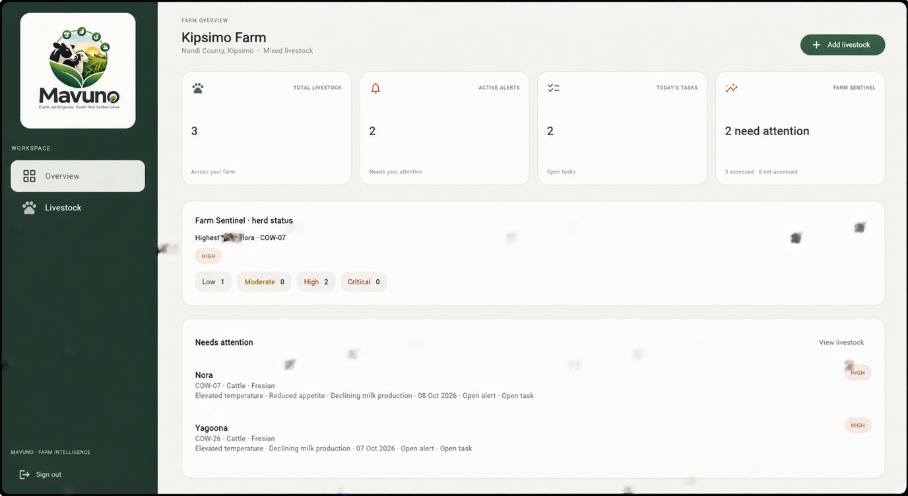
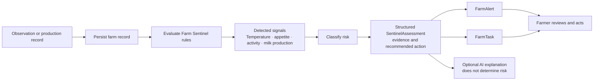
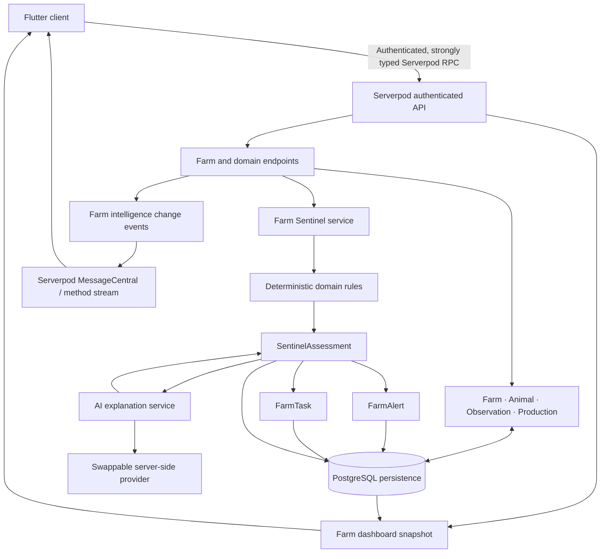

# 🌾 Mavuno  Farm Intelligence & Early Warning Platform



>
>***Mavuno** is a farm-management and early-warning application for smallholder livestock farmers. It brings farm records, livestock observations, deterministic Farm Sentinel assessments, alerts, and follow-up tasks into one authenticated Flutter app backed by Serverpod*

---
## The problem

Farm observations and production records can be difficult to compare when they are kept in separate places. Changes in temperature, appetite, activity, or milk production may be harder to spot in time to decide what to check next. Mavuno organizes those records and highlights patterns that may need attention. It is decision support, not veterinary diagnosis or a replacement for professional care.

## The solution

Farmers record structured information about animals. Farm Sentinel evaluates persisted observations and production records using explicit deterministic rules, stores an assessment with its evidence, and creates or updates related alerts and follow-up tasks. The dashboard puts current farm priorities in one view.



## Why Mavuno is different

1. **Farm records come first.** Sentinel uses persisted, structured observations and production records.
2. **Deterministic rules determine risk.** The same records produce the same signals and classification.
3. **Assessments retain evidence.** Signals, source context, and recommended actions are stored with the assessment.
4. **Alerts and tasks make results actionable.** Sentinel maintains active alerts and one open follow-up task per animal as assessments are reevaluated.
5. **AI explains an existing assessment.** **AI does not decide whether an animal is high risk.**

### Current Sentinel rules

These are Mavuno's current deterministic early-warning thresholds. They are implementation rules, not universal veterinary thresholds or diagnoses.

| Persisted pattern | Signal |
| --- | --- |
| Temperature at or above 39.5 °C | Elevated temperature |
| Appetite score at or below 4/10 | Reduced appetite |
| Activity score at or below 4/10 | Reduced activity |
| Milk production decline of at least 20% between the latest two compatible records | Declining milk production |

Milk records must have matching units, and the earlier value must be greater than zero for the decline comparison.

Signals are counted to classify risk:

| Signal count | Mavuno risk level |
| ---: | --- |
| 0 | LOW |
| 1 | MODERATE |
| 2–3 | HIGH |
| 4 | CRITICAL |

An assessment describes an abnormal pattern that may require attention; it does not identify a disease.

### Illustrative example

This example illustrates the rules; it is not a diagnosis or a claim about a particular farm record.

```text
Farmer → Farm → Nora · COW-07
Temperature: 40.1 °C · Appetite: 2/10 · Activity: 3/10
→ Three signals → HIGH early-warning assessment
→ Evidence and recommended action → Farm alert + follow-up task
```

If two compatible milk records also show a decline of at least 20%, that is a fourth signal and the classification becomes CRITICAL. The farmer can open the animal record to review the underlying evidence and decide what to do next.

## Core features

### Identity and farm management

- Email-based Serverpod authentication and farm onboarding.
- Farm and livestock records with server-enforced ownership boundaries.
- Animal browsing and detail pages.

### Field records

- Persisted animal observations for temperature, appetite, activity, selected symptoms, and notes.
- Separate persisted production records, including milk quantity and unit.
- Validation for supported values and record times.

### Farm Sentinel

- Deterministic signals and LOW, MODERATE, HIGH, and CRITICAL classifications.
- Persisted `SentinelAssessment` records containing detected signals and recommended actions.
- Automatic reevaluation after an observation or production record is created.
- Precautionary recommendations; no disease diagnosis.

### Alerts, tasks, and dashboard

- Sentinel-generated farm alerts and one open Sentinel follow-up task per animal, updated/deduplicated on reevaluation.
- One authenticated farm dashboard snapshot with the latest assessment per animal, herd risk counts, animals needing attention, active alerts, open tasks (including tasks without a due date), recent observations, and milk comparisons when two compatible records exist.
- Returning from animal detail reloads the dashboard data.

### AI explanation

- An optional, authenticated server-side request explains the latest persisted Sentinel assessment.
- The explanation is clearly presented separately from the deterministic assessment; provider unavailability does not block the assessment, alert, or task.

## System architecture



Serverpod provides the authenticated backend, generated client/server protocol, persistence, domain endpoints, ownership checks, farm-level dashboard aggregation, and Sentinel orchestration. It is part of the product architecture, not only a database wrapper.

## AI explanation (Phase 7)

Farm Sentinel risk, signals, alerts, and tasks remain deterministic. An authenticated endpoint can ask a server-side provider to explain the latest persisted assessment. The endpoint loads the animal and assessment after checking farm ownership; Flutter cannot submit or override assessment evidence. Explanations are structured, stored with an assessment-content key, and reused while that evidence is unchanged. Provider errors leave the deterministic assessment available.

The provider prompt forbids diagnoses, invented evidence, and treatment advice. Server validation also rejects malformed output, common diagnostic or treatment claims, and numbers absent from the evidence. Signals in the explanation response are always built from the persisted deterministic assessment.

The current provider adapter uses the Groq chat completions API. For local development it reads OS environment variables first, then the workspace-root `.env` file (Serverpod CLI itself does not load `.env`). Set `GROQ_API_KEY` there or in the server process environment. `GROQ_MODEL` defaults to `openai/gpt-oss-120b`; `GROQ_SERVICE_TIER` is optional and defaults to Groq's `on_demand` tier when omitted. Neither provider keys nor model configuration are sent from Flutter. With no key configured, Sentinel works normally and the detail page shows that an AI explanation is unavailable.

## Realtime intelligence updates (Phase 8)

After an observation or production record and its deterministic Sentinel updates persist, Serverpod publishes a small farm-scoped change event. Authenticated clients subscribe through a Serverpod method stream; farm ownership is checked before the stream opens. The dashboard responds by reloading its authenticated snapshot, which remains authoritative. Serverpod MessageCentral provides local delivery and uses its configured cluster delivery when available. Delivery is best effort; reconnects reload the snapshot to catch up.

## Demo data

The authenticated `demo.seedDemo` endpoint is an older, idempotent sample-data seeder. It currently creates a farm named **Mavuno Demo Farm**, not Kipsimo Farm, and includes sample historical health, alert, and task records. It does not produce the brief's clean Kipsimo Farm → Nora / COW-07 walkthrough, and some sample history predates the current Sentinel workflow. Treat those rows as illustrative legacy seed data, not verified farm history or medical claims. The Golden Demo should use real records entered through the app; do not present the legacy seed as Kipsimo Farm or as Nora's verified history.

## Security and data access

- Serverpod authenticated sessions identify the user making each request.
- Server-side `FarmAccess` checks verify farm ownership and resolve animal access through its farm. Client-supplied farm identifiers are never authoritative for ownership.
- Dashboard records are scoped to the owned farm and its animals; cross-farm access is covered by integration tests.
- Put local password overrides in `mavuno_server/config/passwords.yaml`, which is ignored by Git. The checked-in Compose file is for local development only and contains local service credentials; replace them with private values before using Compose in a shared environment. Never reuse local credentials for deployment or commit deployment secrets.

## Technology

Versions below reflect the repository's current SDK constraints and resolved Serverpod dependencies; the Flutter and Dart versions are those used for verification.

- Flutter 3.44.4 and Dart 3.12.2.
- Serverpod 4.0.0 and Serverpod Auth IDP 4.0.0.
- PostgreSQL-backed persistence through Serverpod; the optional Docker Compose service uses PostgreSQL 16. The configured local development and test runtimes use separate Serverpod data paths.
- Generated, strongly typed Serverpod client/server protocol.

## Repository structure

```text
mavuno/
├── AGENTS.md
├── mavuno_client/                 # Generated Serverpod client protocol
├── mavuno_flutter/
│   ├── lib/screens/               # Sign-in, farm workspace, dashboard, records
│   └── test/                      # Flutter widget tests
├── mavuno_server/
│   ├── lib/src/farm/              # Farm domain and ownership
│   ├── lib/src/livestock/         # Animal records
│   ├── lib/src/observations/      # Field observations
│   ├── lib/src/production/        # Production records
│   ├── lib/src/sentinel/          # Rules, assessments, orchestration
│   ├── lib/src/alerts/            # Farm alerts
│   ├── lib/src/tasks/             # Follow-up tasks
│   ├── lib/src/dashboard/         # Farm dashboard aggregation
│   └── test/                      # Rule and endpoint tests
├── pubspec.yaml                   # Dart workspace
└── README.md
```

## Development setup

### Prerequisites

- Flutter SDK 3.44.4 or later in the compatible 3.x range, with its bundled Dart SDK (3.12.2 or later in the compatible 3.x range).
- The Serverpod CLI, matching the project's Serverpod 4.0.0 version.
- Git and a supported local development environment.

### Run the app

```bash
git clone https://github.com/gethsun1/mavuno.git
cd mavuno

# Install the Serverpod CLI and ensure the Dart pub cache bin directory is on PATH.
dart pub global activate serverpod_cli 4.0.0

# Resolve all packages in the Dart workspace.
dart pub get

# Start the backend and its configured Flutter app.
cd mavuno_server
serverpod start
```

The development configuration stores local PostgreSQL data under `mavuno_server/.serverpod/development/pgdata`; Redis is disabled in the local configuration. `serverpod start` watches for code generation and reloads. The companion Flutter app is configured to launch with it. To launch Flutter separately, leave the server running and use another terminal:

```bash
cd mavuno/mavuno_flutter
flutter run -d chrome
```

For local credentials or service overrides, use the ignored `mavuno_server/config/passwords.yaml` and the Serverpod configuration files. Do not add private credentials to source-controlled files. The test runtime is separate: it uses an isolated embedded PostgreSQL data directory under `.serverpod/test/pgdata` and does not require Docker or use the development database.

### Run checks

```bash
# Server rules and integration tests
cd mavuno/mavuno_server
dart analyze
dart test

# Flutter analysis and widget tests
cd ../mavuno_flutter
flutter analyze
flutter test
```

Phase 8 verification: `dart test` passes for the server package (60 tests) and `flutter test` passes for the Flutter package (13 tests). `dart analyze` and `flutter analyze` report informational lint/deprecation findings and no compile errors.

## Roadmap

- [x] **Phases 1–3:** Authentication, farm onboarding, ownership, and livestock registration.
- [x] **Phase 4:** Persisted field observations and production records.
- [x] **Phase 5:** Deterministic Farm Sentinel assessments, alerts, and tasks.
- [x] **Phase 6:** Actionable farm dashboard and authenticated snapshot aggregation.
- [x] **Phase 7:** AI Sentinel explanation of an existing structured assessment.
- [x] **Phase 8:** Serverpod realtime farm intelligence events and dashboard snapshot refresh.
- [x] **Phase 9:** Product polish, responsive dashboard, farmer-facing states, and hackathon demo readiness review.
