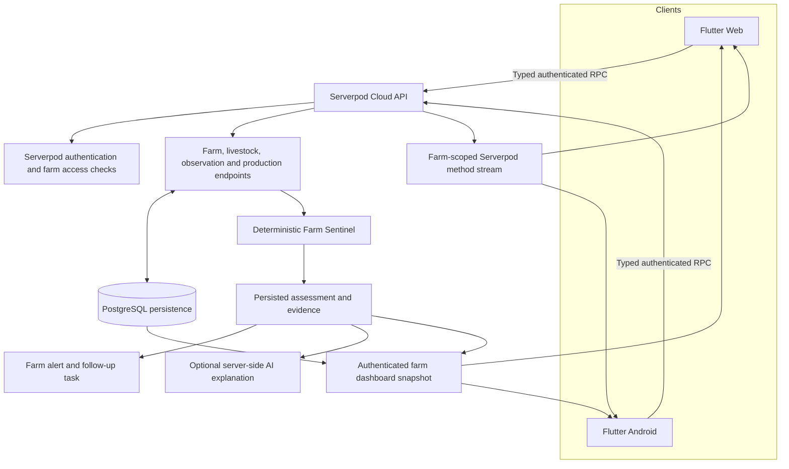

# Mavuno

### Farm Intelligence & Early Warning for Smallholder Livestock Farmers

Farmers record what they see. Mavuno turns structured observations and production records into deterministic early warnings, explainable assessments, farm alerts and follow-up tasks.

**Flutter Web + Android · Serverpod 4 · PostgreSQL · Realtime · Optional AI explanation**

[Open the live application](https://mavuno.serverpod.space/) · [Download Android](https://github.com/gethsun1/mavuno/releases/download/v1.0.0/mavuno-release.apk) · [Release notes](https://github.com/gethsun1/mavuno/releases/tag/v1.0.0) · [Production API](https://mavuno.api.serverpod.space/)


## Try Mavuno

| Platform | Link |
| --- | --- |
| Web application | [Open Mavuno](https://mavuno.serverpod.space/) |
| Android | [Download Mavuno v1.0.0 APK](https://github.com/gethsun1/mavuno/releases/download/v1.0.0/mavuno-release.apk) |
| Release notes | [Mavuno v1.0.0 — Android Release](https://github.com/gethsun1/mavuno/releases/tag/v1.0.0) |
| Production API | [mavuno.api.serverpod.space](https://mavuno.api.serverpod.space/) |

The Android release is an APK for Android 7.0 (API 24) and later. Its application ID is `com.mavuno.farm` and its version is `1.0.0+1`.

## The product

Farmers make observations throughout the day, but isolated notes are hard to compare and easy to overlook. Mavuno stores structured animal observations alongside production records, then checks those persisted facts for patterns that may deserve attention. A farmer can review the signals and recommended next action behind an assessment, and follow up through farm alerts and tasks.

Farm Sentinel is designed for early warning and decision support. It makes its rules and evidence visible so a farmer can understand what contributed to an assessment. It does not identify a disease or replace veterinary care.

## A 30-second product story

1. A farmer records an animal observation or milk production value.
2. Farm Sentinel evaluates the persisted records using deterministic rules.
3. Mavuno shows the assessment, detected signals, evidence and recommended next action.
4. The system updates the farm alert and follow-up task; connected dashboards refresh through Serverpod realtime.
5. When enabled, server-side AI can explain the persisted assessment. It does not choose the risk level.

Every count and assessment shown in the application comes from farm records. An animal without an assessment is shown as **Not assessed**.

## Core capabilities

- Serverpod account authentication, farm onboarding and farm management.
- Livestock registration, browsing and animal detail.
- Animal photos with Web file selection and Android camera/gallery options.
- Persisted observations for temperature, appetite, activity, selected symptoms and notes.
- Separate milk production records with quantity and unit.
- Farm Sentinel assessments, farm alerts and follow-up tasks.
- A farm dashboard with current assessments, alerts, tasks and recent records.
- Optional server-side AI explanations of persisted Sentinel assessments.
- Farm-scoped Serverpod realtime events that prompt connected clients to refresh dashboard state.
- Responsive Flutter Web and Android clients sharing the same backend.

## Farm Sentinel

Sentinel evaluates persisted farm records on the server using explicit deterministic rules. The current signals are:

| Signal | Rule |
| --- | --- |
| Elevated temperature | Temperature at or above **39.5 °C** |
| Reduced appetite | Appetite at or below **4/10** |
| Reduced activity | Activity at or below **4/10** |
| Declining milk production | At least **20%** decline between the latest two compatible milk records |

Milk comparisons require matching units and an earlier value greater than zero. Sentinel counts the detected signals to assign its assessment level:

| Signal count | Assessment |
| ---: | --- |
| 0 | LOW |
| 1 | MODERATE |
| 2–3 | HIGH |
| 4 | CRITICAL |

The persisted assessment, its evidence and recommended action are the source of truth. Re-evaluation can update the animal's active alert and open follow-up task, and the dashboard summarizes the latest farm state. A level is a deterministic early-warning category, not a probability or a veterinary risk percentage. These thresholds are product rules, not universal clinical guidance.

## AI explanations

AI is an optional explanation layer. It does not set the Sentinel level, choose the detected signals or create an assessment from a client prompt.

```text
Persisted observation and production records
                    ↓
         Deterministic Farm Sentinel
                    ↓
       Persisted assessment and evidence
                    ↓
         Optional AI explanation
```

The authenticated server loads the persisted assessment after checking access to its farm and animal. The provider receives that stored evidence; the client cannot submit replacement assessment facts. Output is validated to avoid unsupported evidence and diagnostic or treatment claims. If the provider is unavailable, the deterministic assessment, alerts and tasks remain available. Groq credentials and provider calls stay on the server.

## Animal photos

Photos use Serverpod's private cloud storage. The server derives each storage path from an authorized farm and animal, verifies the upload, and stores the private path on the animal record. Viewing a photo requires an ownership-checked endpoint call that returns a short-lived URL; the storage path alone does not grant access.

The clients accept JPEG, PNG and WebP files up to 5 MB and request a 1600-pixel resize before upload. Web uses file selection. Android offers camera and gallery through the platform picker. Animals without a photo use a species emoji fallback. Upload progress, validation errors, replace and remove actions are shown in the profile flow.

## Realtime updates

After a record and its Sentinel updates are persisted, the server publishes a farm-scoped change event. Authenticated clients subscribe through a Serverpod method stream and reload the dashboard snapshot when an event arrives.

```text
Observation saved → Sentinel evaluates → Assessment, alert and task persisted
     → Farm-scoped realtime event → Client refreshes authoritative dashboard
```

Realtime is the delivery mechanism, not the source of truth. Persisted Serverpod/PostgreSQL state remains authoritative; reconnecting clients reload their snapshot.

## Architecture

```text
Flutter Web / Android
        ↓
Serverpod typed client and authenticated endpoints
        ↓
Farm domain and server-side ownership checks
        ↓
PostgreSQL persisted farm records
        ↓
Deterministic Farm Sentinel
        ↓
Persisted assessments → Alerts / Tasks
        ↓
Serverpod realtime events → Dashboard refresh

Optional: persisted Sentinel assessment → server-side AI explanation
```

Farm Sentinel is authoritative for the assessment and recommendation. AI receives persisted evidence to explain; it cannot replace the facts or determine the risk level.



Both clients use the same production backend. Serverpod provides authenticated typed endpoints, generated client/server protocol, PostgreSQL persistence, server-side domain logic and realtime method streams. The deployed application and API run on Serverpod Cloud.

## Technology

| Area | Technology |
| --- | --- |
| Clients | Flutter, Dart, Flutter Web, Android |
| Backend | Serverpod 4.0.0, Dart, authenticated typed endpoints |
| Persistence | PostgreSQL through Serverpod |
| Realtime | Serverpod method streams / MessageCentral |
| AI explanations | Server-side Groq chat completions integration; configured default model `openai/gpt-oss-120b` |
| Deployment | Serverpod Cloud |

## Android release

- **Application ID:** `com.mavuno.farm`
- **Version:** `1.0.0+1`
- **Minimum Android version:** Android 7.0 / API 24
- **Artifact:** `mavuno-release.apk` (approximately 26.3 MB)
- **Production API:** [https://mavuno.api.serverpod.space/](https://mavuno.api.serverpod.space/)
- **Download:** [Mavuno v1.0.0 APK](https://github.com/gethsun1/mavuno/releases/download/v1.0.0/mavuno-release.apk)

The release APK was signed, installed on a physical Android device and manually verified against the production Serverpod Cloud backend.

## Security and access

- Farm data requests use Serverpod authenticated sessions.
- Server-side ownership checks enforce access to farms and animals; client-supplied identifiers do not grant access.
- Sentinel evaluations and assessment evidence are created and controlled by the server.
- AI provider credentials and production Cloud credentials are managed outside the Flutter client and source repository.
- Android signing keys and passwords are local release credentials and must not be committed.
- Local passwords and private configuration belong in ignored local configuration files, never in tracked source.
- Animal photographs use Serverpod's private cloud-storage namespace. Upload descriptions and temporary photo URLs are issued only after the server checks farm and animal ownership.

## Screenshots

The capture checklist and filenames are in [`docs/screenshots/README.md`](docs/screenshots/README.md). Screenshots are intentionally omitted until captured from the real application; no sample or fabricated product screens are included.

## Development

### Prerequisites

- Flutter 3.44.4 or a compatible Flutter 3.x SDK, with Dart 3.12.2 or compatible.
- Serverpod CLI 4.0.0.
- Git and a supported development environment.

### Get the code and dependencies

```bash
git clone https://github.com/gethsun1/mavuno.git
cd mavuno
dart pub global activate serverpod_cli 4.0.0
dart pub get
```

The normal local development entry point starts Serverpod and its configured Flutter app together:

```bash
cd mavuno_server
serverpod start
```

The local configuration keeps its embedded PostgreSQL development data under `mavuno_server/.serverpod/development/pgdata`. The server watches source changes for incremental generation and reload. If running Flutter separately, keep the backend available and use a second terminal:

```bash
cd mavuno_flutter
flutter run -d chrome
```

For local service/password overrides, use the ignored configuration under `mavuno_server/config/`. Do not place production credentials in tracked files. The test configuration uses a separate embedded PostgreSQL data path and does not require Docker.

### Checks

```bash
cd mavuno_server
dart analyze
dart test

cd ../mavuno_flutter
flutter analyze
flutter test
```

Analysis may report informational lints or deprecations; check the command exit status and resolve compile errors. The current verification results for this release are recorded below.

## Verification

- Server tests: **64 passed** (`dart test`).
- Flutter tests: **15 passed** (`flutter test`).
- `dart analyze`: **exit 0**.
- `flutter analyze`: **exit 1**, with 22 informational lint/deprecation findings and no compile errors.
- `flutter build web --base-href / --dart-define=SERVER_URL=https://mavuno.api.serverpod.space/`: **passed**.
- `git diff --check`: **passed**.
- Serverpod Cloud deployment: **build and rollout passed**; Cloud applied the additive animal-photo migration.
- Existing v1.0.0 Android APK: previously signed and physically verified. A new Android compile was blocked because this workspace has no Android SDK; the existing signed artifacts were preserved.

## Product boundaries

Mavuno Sentinel is an early-warning and decision-support system. It does not provide veterinary diagnosis or replace professional veterinary care. An assessment highlights a pattern in recorded facts and suggests a follow-up action; it cannot establish the cause of an animal's condition. AI explains the structured assessment and is not an independent diagnostic system.

## Project structure

```text
mavuno/
├── mavuno_client/                 # Generated Serverpod client protocol
├── mavuno_flutter/
│   ├── lib/screens/               # Sign-in, downloads, farm workspace and records
│   └── test/                      # Flutter widget tests
├── mavuno_server/
│   ├── lib/src/farm/              # Farm domain and ownership checks
│   ├── lib/src/livestock/         # Animal records
│   ├── lib/src/observations/      # Field observations
│   ├── lib/src/production/        # Production records
│   ├── lib/src/sentinel/          # Rules, assessments and orchestration
│   ├── lib/src/alerts/            # Farm alerts
│   ├── lib/src/tasks/             # Follow-up tasks
│   ├── lib/src/dashboard/         # Farm dashboard aggregation
│   └── test/                      # Rule and endpoint tests
└── README.md
```
